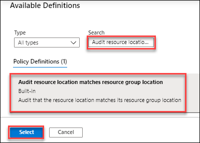
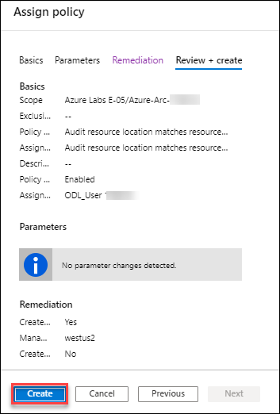
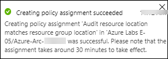

# Exercise 1: Getting started with Azure Governance 

In this exercise, you will walk through some of the Azure Governance capabilities including Azure Activity Logs, Resource tags and policies. In the first exercise we’ll be trying out these capabilities with Azure resources and then extend to Azure Arc later during the lab.  
## Task 1: Login to Azure Portal
In this task, you will login to Azure using the lab credentials and browse through **Azure Portal**.
1. Navigate to [Azure Portal](https://portal.azure.com/).

   

2. Login with Azure credentials **Username** and **Password** shown on **Environment Details** page. You can use copy icon to copy the values.

   

3. Enter the Username value in **Email**, **phone** or **Skype** field, and select the **Next**. 

   

4. Now, enter the **Password** value, and select **Sign in**.

   

5. Once you select the **Sign in** and **Stay signed in?** popup will appear, select the **Yes** to continue.
 
   

6. You will see **Welcome to Microsoft Azure** popup windows once you signed into Azure. Select **Maybe later**.
 
   
	
## Task 2: Azure Activity Logs
The Azure Activity Log provides insight into events that have occurred in Azure. In this task you will explore on Azure Activity Logs on the existing **resource group** in Azure. 
1. In your Azure portal, browse through the **Resource groups**. From the navigate panel, select **Resource groups**.

   

2. You will see one resource group like **Azure-ARC-170523**, where 170523 is unique id and it may be different for your lab
environment. Select **Azure-ARC-170523**.

    

3. Now, select the **Activity logs** to check the activities of last few hours on this **resource group**.
 
   

4. Under Activity logs you can see ***Write Azure Arc Machines*** action in **Succeeded** state and this action is performed by **https://odl_user_sp_170523**. To check more details for this activity log, click on the activity log **operation** Name. You can go to the resource group overview and see one resource with resource type ***Microsoft.HybridCompute***.

   
 
## Task 3: Manage Resources Tags
You apply tags to your Azure resources, resource groups, and subscriptions to logically organize them into a taxonomy. Each tag consists of a name and a value pair. For example, you can apply the name "**Environment**" and the value "**Production**" to all the resources in production.
1. Basically, tags can be applied on **Subscription**, **resource group** and **resource** level. Wherever you want to apply the tag just click on that resource and from left menu blade click on the **Tag**.
2. In this task, we will apply **Tag** on resource group. Click on the **Tag**.

   
 
3. You will see several **Tags** are already there; you can create new Tag, remove existing Tag and then Save them.

   
        
## Task 4: Azure Policies
Understanding how to create and manage policies in Azure is important for staying compliant with your corporate standards and service level agreements. In this tutorial, you learn to use Azure Policy to do some of the more common tasks related to creating, assigning, and managing policies across your organization, such as:

  * Assign a policy to enforce a condition for resources you create in the future
  * Create and assign an initiative definition to track compliance for multiple resources
  * Resolve a non-compliant or denied resource
  * Implement a new policy across an organization
If you would like to assign a policy to identify the current compliance state of your existing resources, the QuickStart articles go over how to do so.
1. Go to your **Resource group** and click on the **Policies** under Settings. Click on **Compliance** and then check if there is any assignment on current scope. New policy assignments can be done through **Assign policy** and **Assign Initiative** options, Initiative can be a group of policies. Click on **Assign policy**.

   

2. On **Basics** tab, click on the three dot’s (ellipses) to select the existing policy definition.

    

3. Now, in **Search box** type ***Audit resource location matches resource group location*** and click on the searched definition and then click on **Select**.

    

4. Now, click on **next** to move on parameters tab.

    

5. On parameteres tab leave everything default and click on **Next**.

    

6. Make sure **checkbox** is checked, then select a **region** in which your resource group is deployed on **Remediation** tab and click on the **Review + create**.

   

7. On **Review + create** tab click on the **Create** to create the **policy assignment**.

   
   
8. Once the **policy assignment** is completed, you will see following **notification** on upper right corner of Azure portal.

   
   
This policy will audit if the **resource location** is matching with Resource Group location or not. In next exercise, you will go through the **Hybrid compute instances** and check if the policy is **Compliant** or **not** for those instances. If the location of those instances matches with location of Resource Group it will show the policy as **Compliant** otherwise **Non-complaint**. 
