# Windows Server Management
  * [Windows web servers that are not using secure communication protocols (requires IIS on nodes)](#windows-web-servers-that-are-not-using-secure-communication-protocols-requires-iis-on-nodes)
  * [Windows VMs on which the specified services are not installed and 'Running'](#windows-vms-on-which-the-specified-services-are-not-installed-and-running)
  * [Windows VMs that are not joined to the specified domain](#windows-vms-that-are-not-joined-to-the-specified-domain)
  * [Windows VMs in which the Administrators group contains any of the specified members](#audit-windows-vms-in-which-the-administrators-group-contains-any-of-the-specified-members)
  * [Windows VMs with a pending reboot](#windows-vms-with-a-pending-reboot)
  
# Additional Audit Policies
  * Add tag to all resources in a resource group using Azure policy 
  * Audit certificate going to expire in 30 days 
  * Audit on password policy on the machine 
  * Audit for an application installed on the machine (check for notepad.exe)
  
## Terms used in this exercise:
   * Intiative
   * Remediation tasks
   * Compliant
   * Non-compliant

## Windows web servers that are not using secure communication protocols (requires IIS on nodes)

In this task, you will create initialive assignment **Audit Windows web servers that are not using secure communication protocols**, which will audit the VM as **Compliant** and **Non-compliant**. This initiative have two policy definations one is to install the pre-requsite to the guest os and other is to audit the compliance status.

You will apply the **Initiatives** at resource group and it will audit all the guest VMs within that resource group.

1. In your Azure portal, browse through the **Resource groups**. From the navigate panel, select **Resource groups**.

   

1. You will see one resource group like **Azure-ARC-170523**, where 170523 is unique id and it may be different for your lab
environment. Select **Azure-ARC-170523**.

    
   
1. Now, select the **Policies** then select **Compliance** and then select **Assign initiative** to assign the in-build initiative.
   
   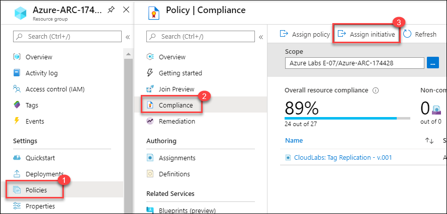
   
1. Leave default value for the **Scope**, **Exclusions** and for **Basics** click on the ellipses (…) to the right of **Initiative definition**.

   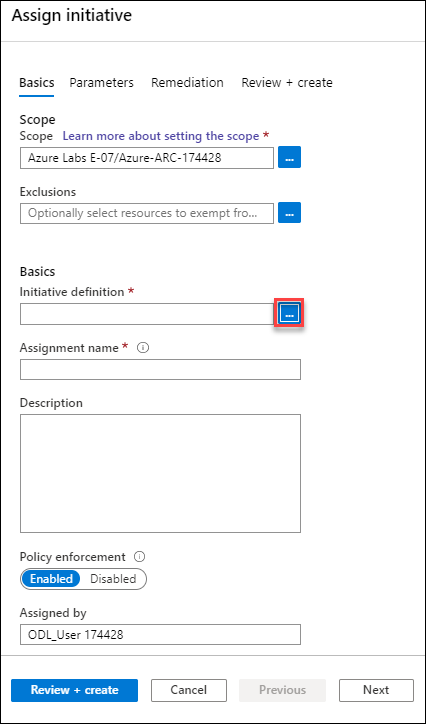
   
1. In the Search window for available definitions, type **secure** and select the one called **Audit Windows web servers that are not using secure communication protocols**. Click the **Select** button below.

   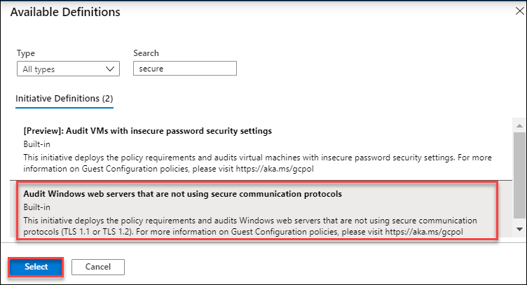
   
1. Click **Next** at the bottom of the window and on **Parameteres** tab leave default value and move to the next tab by selecting the **Next** button.

   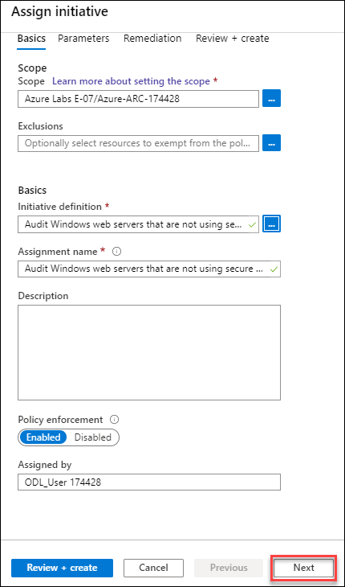
    
1. On **Remediation** blade, read the description and then select the **checkbox** for **Create a remediation task**. This ensures that the policy will apply to existing resources after the initiative is assigned. If that box is not selected, then the initiative only applies to newly created resources.

1. Select the **Create a Managed Identity** check box and the click **Next** again.

   
   
1. Then at the bottom of the **Assign initiative** window click on **Create**.

   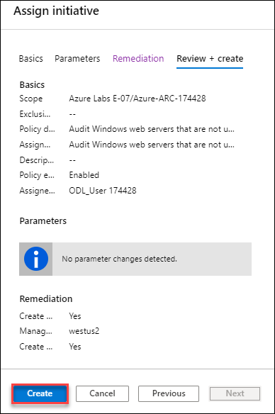
   
1. Click on the new **initiative** just created **Audit Windows web servers that are not using secure communication protocols**.

   
   
1. Click **Create a Remediation Task** at the top right, it will start the Remediation if it is not started already, if it is already started then it can give error like one remediation task is already running, you can ignore that error and proceed.

   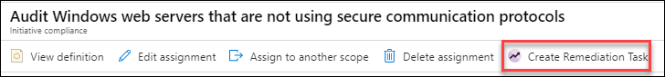
   
1. Check mark the Re-evalute resource compliance before remediating, select the all locations and then click on **Remediate**.

   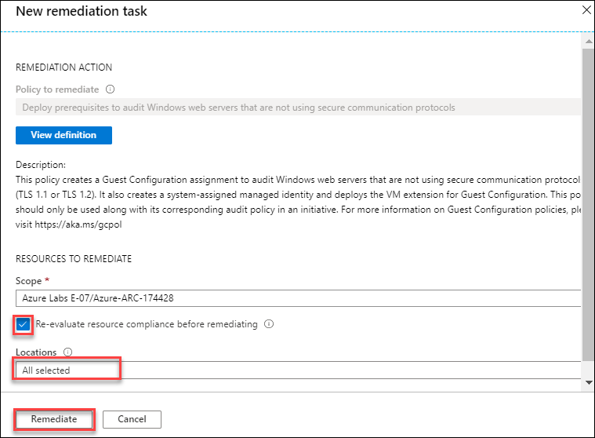
   
1. In the next window at the bottom you will see a blue circle beside **Evaluating**. When it is successful and completed, the circle will turn green and it will say **Complete**. NOTE: if you had many ARC servers, you could evaluate the all at once but changing the scope to select one of more locations or all within a resource group.

   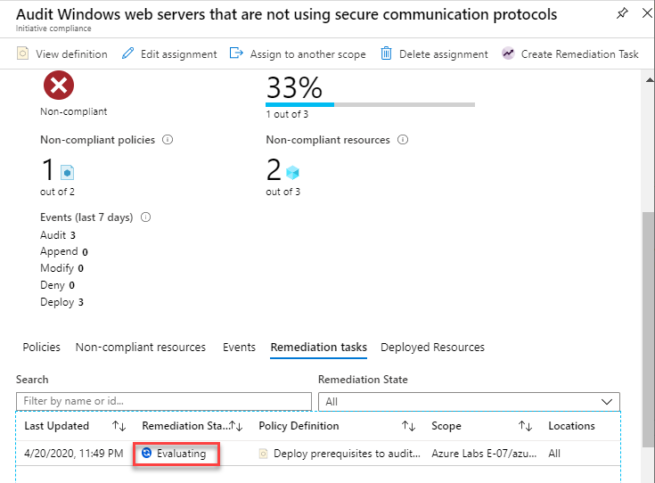
    
1. Pre-connected-winvm is already configured with IIS web server and winvm is still don't have IIS web server. Here, it will show **Pre-connected-winvm** as **Non-compliant** and **winvm** as **Compliant**. You can go to each windows Arc servers from Azure portal and check the policy compliance.

1. Search for Azure Arc from search box and then select the Machines – Azure Arc.

   
 
1. You will see, following four machines are in **Connected** state. Click on the **winvm** to check the **Compliance**.

   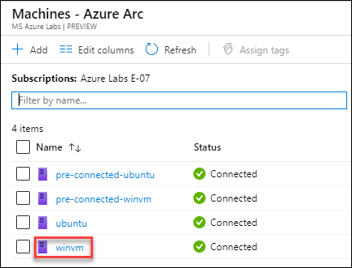
   
1. Now, click on the **Policies** and check the **Compliance** state for the server. It should be in Compliant State, because IIS enables the TLS 1.1, 1.2 protocol and in this server IIS is not enabled

   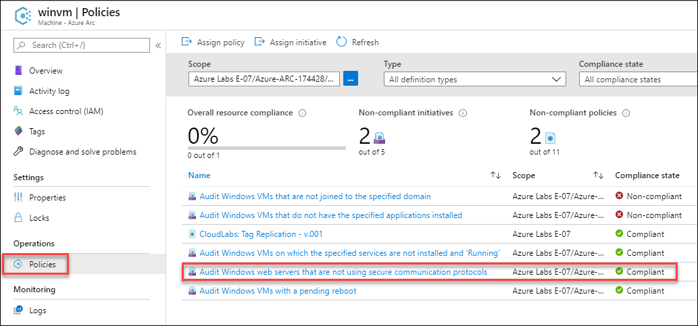
   
1. Similarly, you can check the **Compliance** state for the Pre-connected-winvm server and it should be **Non-compliant**, becouse IIS server is installed in this, which is enabling the TLS protocol.

### Windows VMs on which the specified services are not installed and 'Running' 

This initiative deploys the policy requirements and audits Windows virtual machines on which the specified services are not installed and 'Running'.

1. You can Assign this intialtive very simillar way of previous one, in this you have to provide the windows service name in parameter, services like:
   
   * **SecurityHealthService:** Windows Security Service handles unified device protection and health information)
   * **WSearch:** Provides content indexing, property caching, and search results for files, e-mail, and other content.
   * **Dnscache:** The DNS Client service (dnscache) caches Domain Name System (DNS) names and registers the full computer name for this computer. If the service is stopped, DNS names will continue to be resolved. However, the results of DNS name queries will not be cached and the computer's name will not be registered. If the service is disabled, any services that explicitly depend on it will fail to start.
   * **WinRM:** Windows Remote Management (WinRM) service implements the WS-Management protocol for remote management. WS-Management is a standard web services protocol used for remote software and hardware management. The WinRM service listens on the network for WS-Management requests and processes them. The WinRM Service needs to be configured with a listener using winrm.cmd command line tool or through Group Policy in order for it to listen over the network. The WinRM service provides access to WMI data and enables event collection. Event collection and subscription to events require that the service is running. WinRM messages use HTTP and HTTPS as transports. The WinRM service does not depend on IIS but is preconfigured to share a port with IIS on the same machine.  The WinRM service reserves the /wsman URL prefix. To prevent conflicts with IIS, administrators should ensure that any websites hosted on IIS do not use the /wsman URL prefix.

### Windows VMs that are not joined to the specified domain

This initiative deploys the policy requirements and audits Windows virtual machines that are not joined to the specified domain. You need to define **domain name** in parameter when you **Assign initiative**.

### Audit Windows VMs in which the Administrators group contains any of the specified members

This initiative deploys the policy requirements and audits Windows virtual machines in which the Administrators group contains any of the specified members. 
Define **Member/Members name** in parameter when you **Assign initiative**.

### Windows VMs with a pending reboot

This initiative deploys the policy requirements and audits Windows virtual machines with a pending reboot.

You can see the **Compliance state** for all the Initiatives assigned above by going to the Arc Server Manager. Search for **Azure Arc** from the Azure resources, services search box from the top of the portal and then click on Azure Arc. After this, select **Manage Servers**.

You can now go to individual Arc Machines and then click on policy to see the **Compliance state**.

   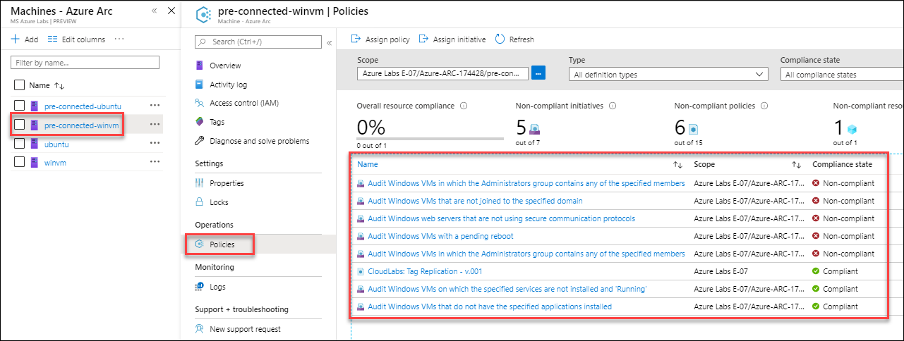

 

